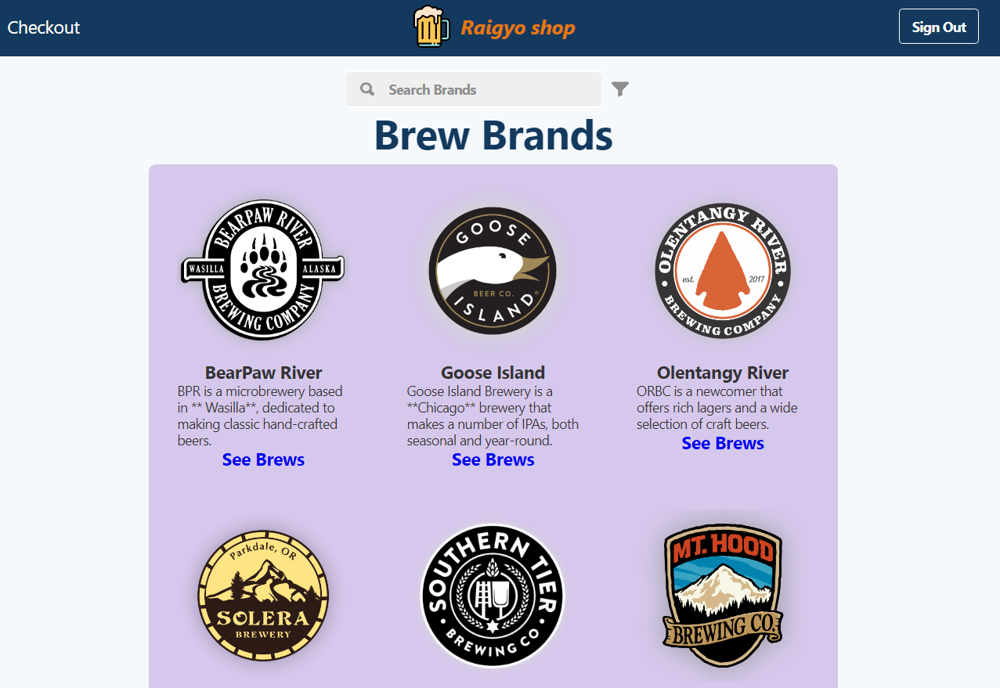
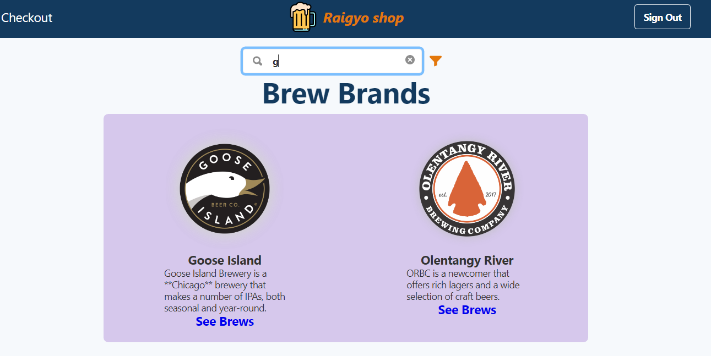
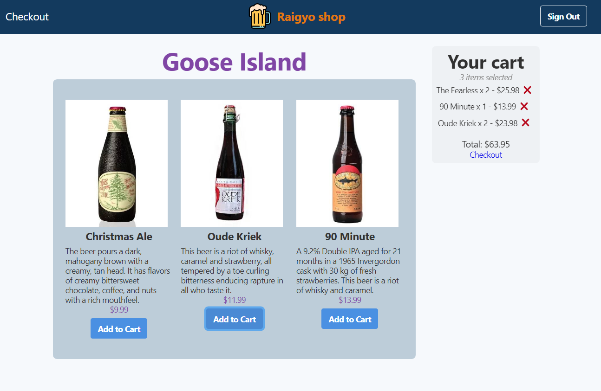
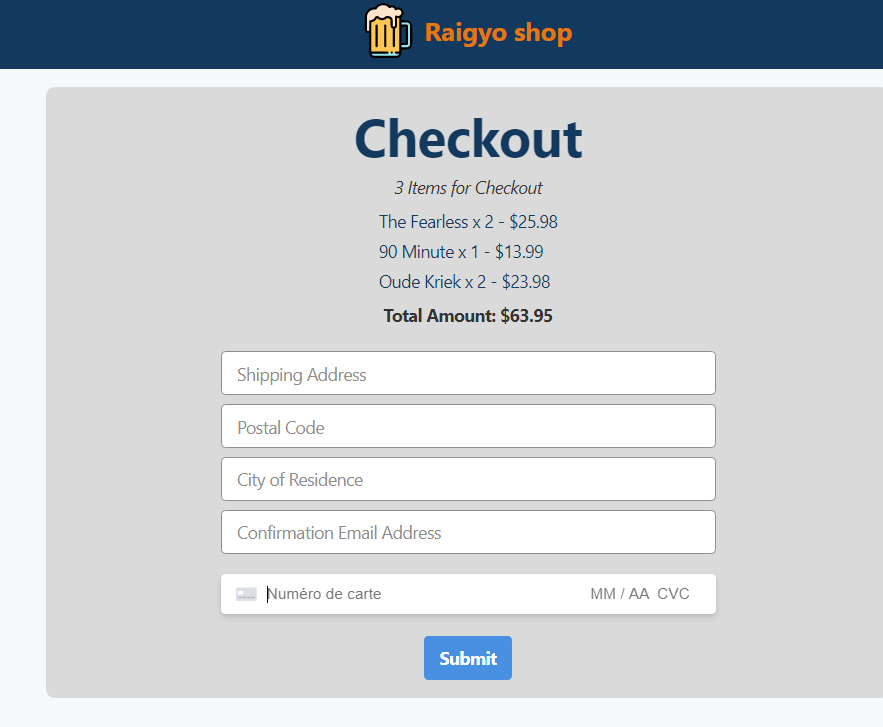

# Online Store with React, Strapi CMS with GraphQL & Stripe

*July 2020*

> 🔨 From Udemy '[Build an Online Store with React and GraphQL in 90 Minutes](https://www.udemy.com/course/build-an-online-store-with-react-and-graphql-in-90-minutes/)'.


## About










## How to launch in dev mode

React app: `npm start`

Strapi:

```
cd server //(or name choosen)

npm run develop
```

If error: *Cannot find module '../build/Release/sharp.node'*

- - Delete node_modules folder
- Clear npm cache `npm cache clean --force`
- (Optional) upgrade npm packages `npm install npm@latest -g`
- Re-install packages by running `npm install`

## React

Use import in React to import Strapi as component:

```
import Strapi from 'strapi-sdk-javascript/build/main';
```

## GraphQL

Playground in Strapi with documentations and schemas: [Playground](http://localhost:1337/graphql)

In Strapi, in Role & Permission add for users:

*content-type: find + findone*

*Allow to perform this action for: ratelimit*

Exemple to list all brands:

```
query {
	brands {
  	_id
    name
    description
        image {
        name
        }
	}
}
```

## Components & Services

- [MongoDB Atlas](https://www.mongodb.com/cloud/atlas), cloud MongoDB service.
- [Gestalt](https://madewithreact.com/gestalt-react-ui-components/), React UI Components
- [Strapi](https://strapi.io/), Strapi is the leading open-source headless
CMS. It’s 100% Javascript, fully customizable and developer-first
      => Use `npm run develop` to launch strapi in developer mode
      (otherwise won't be possible to add content-types)
- GraphGL: installed using Strapi dashboard.
- [Stripe](https://stripe.com/fr-be), Online payment processing for internet businesses
      => Use `npm i stripe` after modifying *server/api/orders/controllers/order.js*
- [strapi-provider-email-sendgrid](https://www.npmjs.com/package/strapi-provider-email-sendgrid)
- [SendGrid](https://sendgrid.com/)
      => In */server/* use `npm i strapi-provider-email-sendgrid`


## Useful Links

- [Build an Online Store with React and GraphQL in 90 Minutes](https://www.udemy.com/course/build-an-online-store-with-react-and-graphql-in-90-minutes/)
- [Source code for the "Build an Online Store with React and GraphQL in 90 Minutes" Udemy Course.](https://github.com/peelmicro/build-an-online-store-with-react-and-graphql-in-90-minutes)
- [Strapi - Open source Node.js Headless CMS 🚀](https://strapi.io/)
- [Local Strapi + cloud MongoDB Atlas](https://medium.com/@firstsquares/local-strapi-cloud-mongodb-atlas-cc65288f0dee)
- [Stripe: Online payment processing for internet businesses](https://stripe.com/fr-be)
- [FAQ: No LogoTypes shows up..](https://www.udemy.com/course/build-an-online-store-with-react-and-graphql-in-90-minutes/learn/lecture/11669406#questions/9412605)
- [React Spinners](https://www.davidhu.io/react-spinners/)
- [A Guide To The Reduce Method In Javascript​](https://www.freecodecamp.org/news/reduce-f47a7da511a9/)
- [Finally Understand the JavaScript Reduce Method](https://alligator.io/js/finally-understand-reduce/)
- [Reduce() : Le couteau suisse du développeur Javascript](https://medium.com/@hkairi/reduce-le-couteau-suisse-du-d%C3%A9veloppeur-javascript-8cf4b6f98304)
- [Destructuring Props in React](https://medium.com/@lcriswell/destructuring-props-in-react-b1c295005ce0)
- [Deploy Strapi app on Heroku using MongoDB Atlas](https://strapi.io/documentation/v3.x/deployment/heroku.html) (MongoDB tab)
- [How to deploy React App to GitHub Pages](https://dev.to/yuribenjamin/how-to-deploy-react-app-in-github-pages-2a1f)
- [Module build failed: BrowserslistError: Unknown browser query `dead`](https://stackoverflow.com/questions/52939103/browserslisterror-unknown-browser-query-dead-in-react-express-app)
- [My React application failed to compile strapi sdk](https://stackoverflow.com/questions/57650891/my-react-application-failed-to-compile-strapi-sdk)